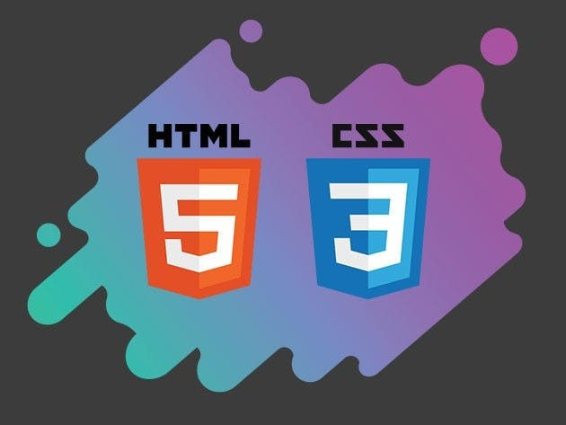

# HTTP-5121 - Web Design

Welcome to the HTTP-5121 Web Design repository! This repo contains all assignments, lab projects, and practice files associated with the course. It's a comprehensive resource for mastering web design using HTML and CSS.

## Learning Resources

Explore these valuable resources to enhance your skills in web development:

- [W3Schools HTML Tutorial](https://www.w3schools.com/html/default.asp)  

These platforms offer extensive materials for learning the fundamentals of HTML and CSS.

> *Note:* You can validate your HTML and CSS code using the W3 Markup Validation Service

## HTML Code Example

Below is a basic example of HTML headings, 
html
<h1>Main Heading</h1>
<h2>Subheading Level 1</h2>
